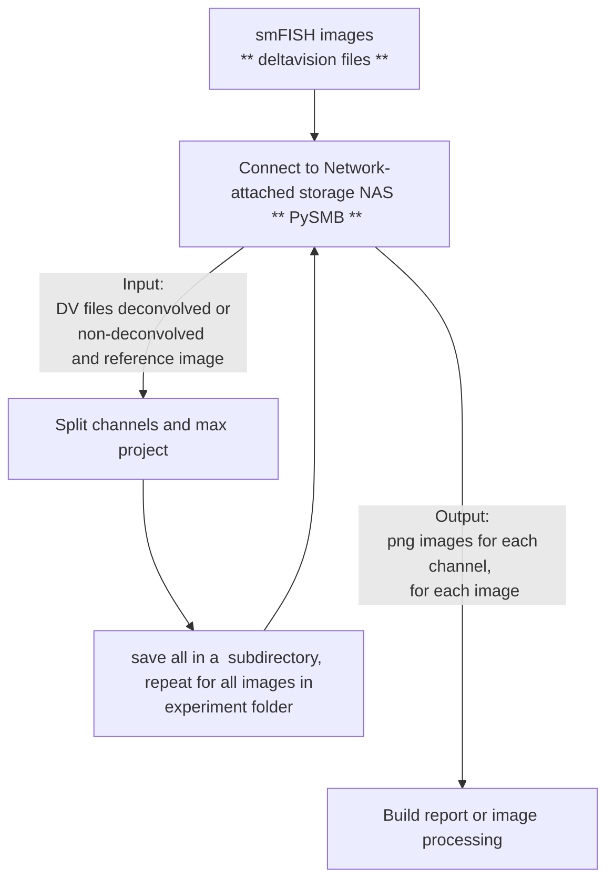

# Convert deltavision files to png automatically
Author: Naly Torres

# Description
Repository to automatically download and visualize deltavision files stored in the Network-attached storage (NAS). This repository uses PySMB to access and transfer data between NAS and a local (your computer) or a remote server (Alpine-HPC). Microscope images are then organized in subdirectories ready for creating a report (use deconvolved version) or image analysis (use non-deconvolved version).

# Code Architecture




# Code overview
## Network-attached storage (NAS) connection
Uses PySMB
## access and read deltavision files
Uses FISHquant
## save files as png in subdirectories
Uses Python

# Installation
> [!TIP]
> Install [Anaconda](https://www.anaconda.com/) before installing this repository and all its dependencies.

* Create conda environment
```
# conda create --name dv2png_env
conda create --name dv2png_env --file dv2png_env.yml
```
* Activate conda environment
```
conda activate dv2png_env
```
* Clone git repository
```
git clone --depth 1 https://github.com/TorresNaly/dv2png.git
```
#### Last edited Jan 7th, 2024. 


