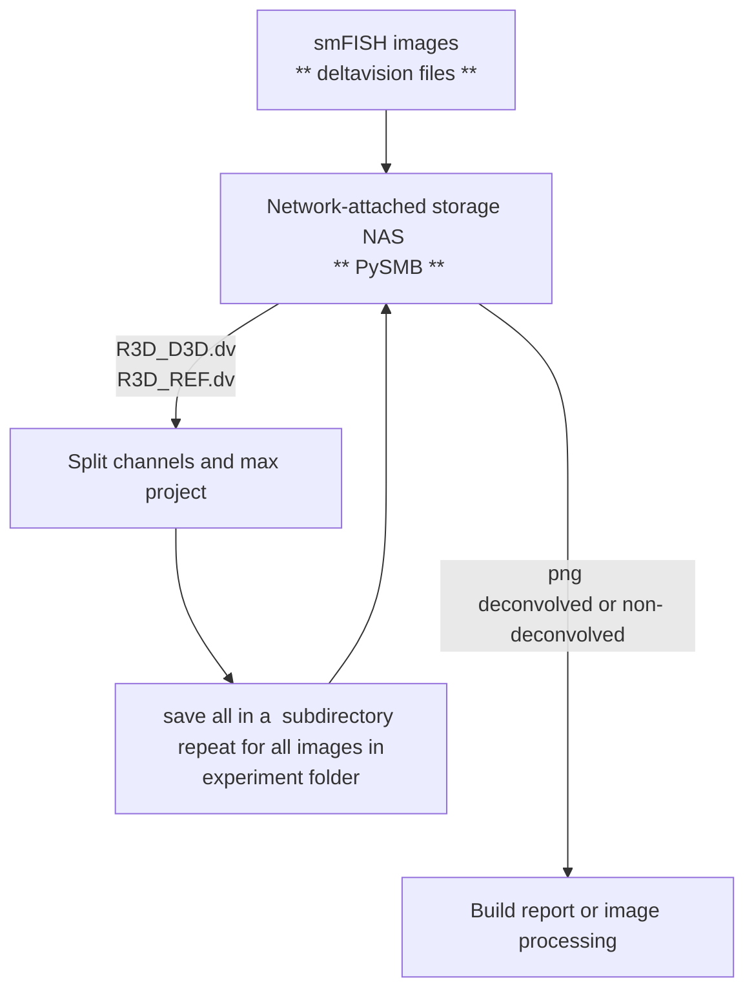

# Convert deltavision files to png automatically
Author: Naly Torres

# Description
Repository to automatically download and organize deltavision images stored in the NAS.  This repository uses PySMB to access and transfer data between Network-attached storage (NAS) and a local or a remote server (Alpine-HPC). Microscope images are then organized in subdirectories for image analysis (non_decolvoved) or for experiment report/display (deconvolved). 

# Code Architecture




# Code overview
## Network-attached storage (NAS) connection
PYsmb' #to connect to the NAS

## deltavision files access and organization

'Bigfish' #to read the deltavision files

## saving as png

'----' #to 
# Installation
> [!TIP]
> I recommend installing [Anaconda](https://www.anaconda.com/) before installing this repository and all its dependencies.

* Create conda environment
```
conda create --name dv2png_env
```
* Activate conda environment
```
conda activate dv2png_env
```
* Clone git repository
```
git clone --depth 1 https://github.com/TorresNaly/dv-png.git
```
#### Last edited Jan 7th, 2024. 


